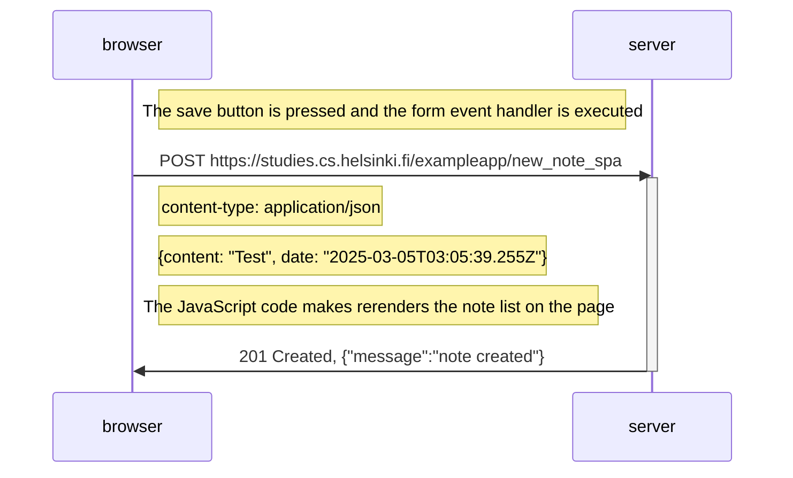

```mermaid
sequenceDiagram
    participant browser
    participant server

    Note right of browser: The save button is pressed and the form event handler is executed
    browser->>server: POST https://studies.cs.helsinki.fi/exampleapp/new_note_spa
    activate server
    Note right of browser: content-type: application/json
    Note right of browser: {content: "Test", date: "2025-03-05T03:05:39.255Z"}
    Note right of browser: The JavaScript code makes rerenders the note list on the page
    server->>browser: 201 Created, {"message":"note created"}
    deactivate server
```
